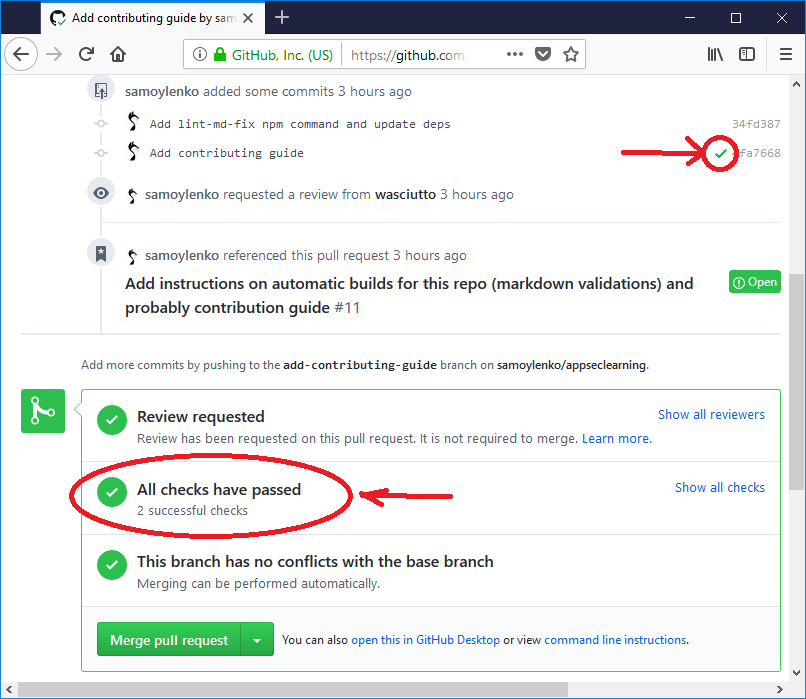

# How to contribute

Thank you for looking to contribute - of course you are welcome to!

This is a text project, and we are using
[Markdown](https://en.wikipedia.org/wiki/Markdown) to format it since it's
natively supported by GitHub.

To ensure we properly use markdown syntax, and everyone follows the same style,
we are using [remark-lint](https://github.com/remarkjs/remark-lint/) with
[remark-preset-lint-recommended](https://github.com/remarkjs/remark-lint/tree/master/packages/remark-preset-lint-recommended)
preset.

Remark syntax will be automatically verified using
[automatic builds](https://travis-ci.org/samoylenko/appseclearning) after you
create a new pull-request. This will look similar to:



You can also run verification locally by running the following commands in the
directory containing this repository. Please note that this requires
[NodeJS](https://nodejs.org) installed, and don't forget to run `npm install` in
the project directory after you clone it.

To verify markdown syntax:

```bash
npm run lint-md
```

`remark-lint` can attempt to automatically fix any issues it finds, but please
always verify results of its work. Note that this action will overwrite all
markdown files in the project, not just the one you are editing.

To attempt automatic syntax fix:

```bash
npm run lint-md-fix
```
