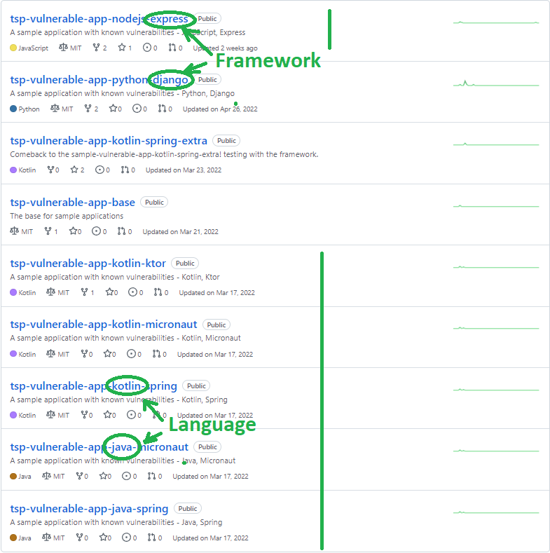
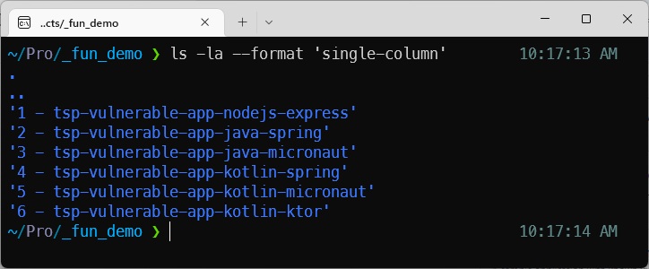
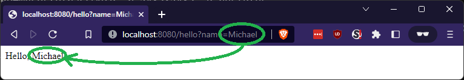
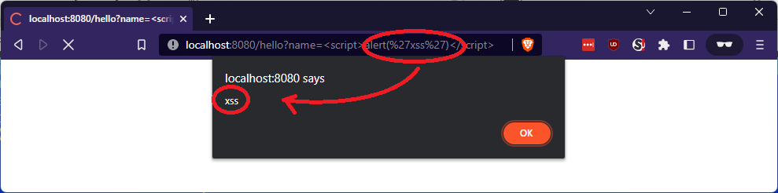
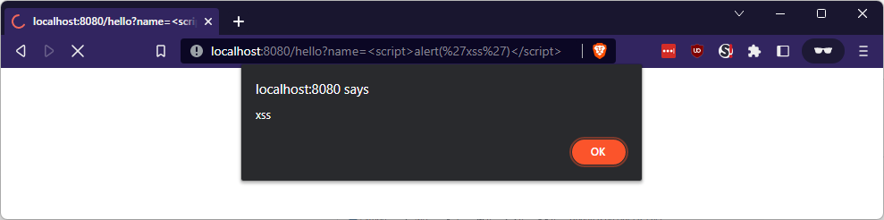
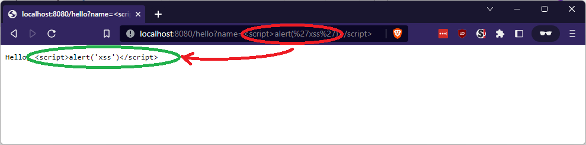
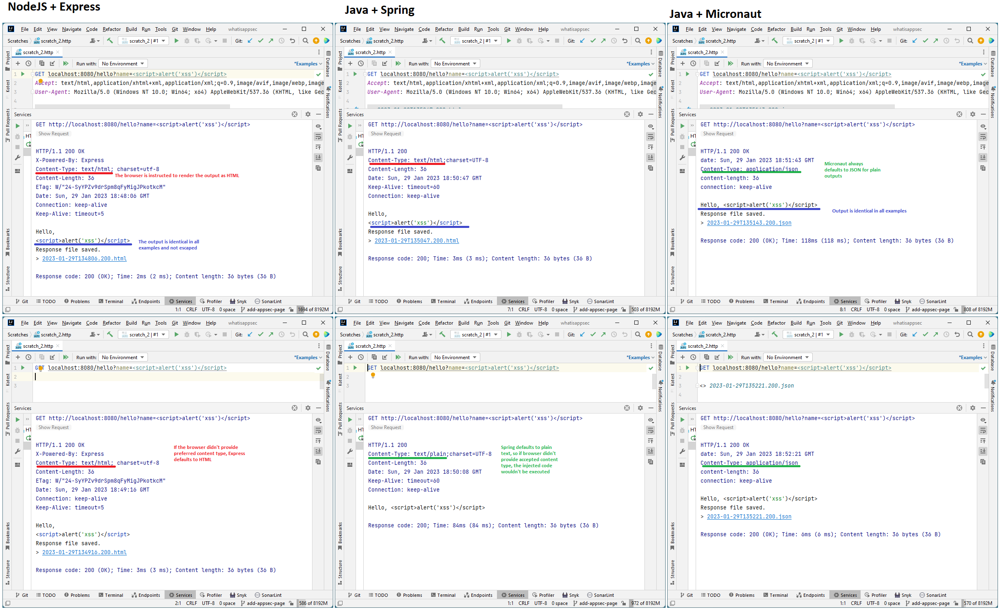
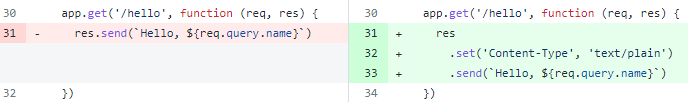
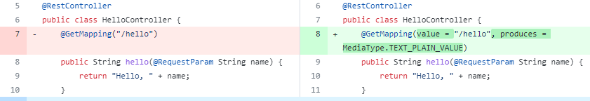

# Modern vulnerability resolution (XSS example): Validation vs. Encoding

Let's take a look at the most basic Cross-Site Scripting example (XSS). For that, we'll use examples in different
popular programming languages and frameworks.

## A basic reflected Cross-Site Scripting injection example:

We will take the most basic example in multiple programming languages and frameworks from here:
https://github.com/orgs/the-scan-project/repositories?q=vulnerable



We clone the repositories to run our experiment:



All these applcations have a `/hello` endpoint which will respond `Hello, $name` to a parameter in the URL. For example,

`http://localhost:8080/hello?name=Michael` will return `Hello, Michael`



So what happens when we try to inject the classic `<script>alert('xss')</script>` in that parameter?

Let's find out!

### NodeJS - Express Application

| Language          | Framework |
|:------------------|:----------|
| JavaScript (Node) | Express   |

The first example in NodeJS is obvious enough:

```javascript
  app.get('/hello', function (req, res) {
    res.send(`Hello, ${req.query.name}`)
})
```

As expected, we get an XSS:



No surprise here.

### Java - Spring Application

| Language | Framework |
|:---------|:----------|
| Java     | Spring    |

Looks pretty much the same, right? Classic:

```java

@RestController
public class HelloController {
    @GetMapping("/hello")
    public String hello(@RequestParam String name) {
        return "Hello, " + name;
    }
}

```

Of course, there's an XSS if we run that!



### Java - Micronaut Application

| Language | Framework |
|:---------|:----------|
| Java     | Micronaut |

Same code, right? Would you expect a different result with this code? Only code annotations differ because the framework
is different:

```java

@Controller("/hello")
class HelloController {
    @Get
    String getName(@QueryValue String name) {
        return "Hello, " + name;
    }
}
```

Lets try it:



Wait, what? No XSS! The injected code was escaped? Was it? But how? It's litereally the same code as before!

### Let's finish our experiment before we investigate what is really going on

_I plan to extend this article with deserialization vulnerabilities, as well - hence I have Kotlin in the picture as
well. But that's later, here's the result we get when we try the injection with the apps we just downloaded:_

| Language | Framework | Did we get the XSS as expected? |
|:---------|:----------|:--------------------------------|
| NodeJS   | Express   | Yes                             | 
| Java     | Spring    | Yes                             | 
| Java     | Micronaut | **No**                          | 
| Kotlin   | Spring    | Yes                             | 
| Kotlin   | Micronaut | **No**                          | 
| Kotlin   | Ktor      | **No**                          | 

## Let's investigate

So what is going on? Does the string get encoded in HTML? Is it escaped? is there an input validation?

Let's take a look at the HTTP protocol level information:



The picture contains three columns and two rows: two requests for each language+framework example:

* The first request emulates a browser and instructs the server the type of content it accepts (HTML)
* The second request is a plain `GET` request (no headers) - to see how that affects the server setting
  the `Content-Type` server in the response.

## What do we see?

We see the following:

1. The output (the`Hello, <script>alert('xss')</script>` string) is identical in all cases. And even though
   nothing being sanitized or validated, it doesn't execute when we are using the Micronaut framework.

2. It appears, that the only difference between having XSS or not is the `Content-Type` header that instructs the
   browser how to treat the server output.

3. The Cross-Site Scripting vulnerability was prevented by the framework not honoring the browser's `Accept:` header and
   setting the `Content-Type` header according to its internal logic

## What is the right fix for this vulnerability?

Based on what we just learned, validating input and escaping the output manually in the code is no longer required. All
this functionality already exists in the modern popular frameworks and libraries and just needs to be used properly.

**The NodeJS + Express application fix:**



**The Java + Spring application fix:**



For many people reading here, this probably only starts the discussion: "why do set plaintext here?". Well, the reason
is - in the modern world of web applications, we need to look at what exactly we are trying to do here - returning this
output at this endpoint:

1. If we'd intended to return a rich HTML output for our user, we wouldn't be constructing the output manually in code.
   We'd use templates and front-end frameworks for that. This is the recommendation that comes back from the Application
   Security team, together with the quick fix using plaintext when we help fixing this vulnerability.
2. If we'd intended to return data in a REST API endpoint, we'd use JSON (or gRPC).
3. So looking at this existing code, it just wants to show a simple string at the screen, so we end up recommending
   making it plaintext to eliminate the vulnerability as soon as possible using as little resources and time as we can.

Actually, OWASP ASVS is backing this decision up in the `V5 Validation, Sanitization and Encoding` section. Output
encoding is the one recommended in most cases like this. The last time I saw an OWASP document recommending input
validation instead was an "OWASP Secure Coding Practices Quick Reference Guide" that was not updated since 2010.

### But what with the Java + Micronaut app?

Any SAST tools that we use will still detect the string concatenation with a user-controlled parameter in the
application. And yes, this is definetely not a false-positive:

```java

@Controller("/hello")
class HelloController {
    @Get
    String getName(@QueryValue String name) {
        return "Hello, " + name;
    }
}
```

This is still an XSS waiting to happen when someone changes behavior of this endpoint. But we just learned why many
modern SAST solutions decrease the priority of this finding, and that the AppSec recommendation here is not implement a
RegEx validation in front of this endpoint, but to ensure that the endpoint is designed according to what it is intended
to do: if it's an HTML page, there should be a template framework in use. And if it's a REST API, the content type
should be set accordingly to ensure there is no scenario for the injection.

## What we learned

We learned a number of important items critical to know for every Application Security Engineer:

1) In the modern web, server and browser are working in tandem to protect the user.
2) Constructing a raw HTML output in code no longer makes any sense - there are templates for that. Micronaut (and other
   newer frameworks, like, e.g. Ktor) all default to JSON or plain text when the endpoint returns an output constructed
   in code (e.g. via string concatenation)
3) Using a modern framework alone in the first place makes it hard to create a new vulnerability.
4) Most popular modern frameworks already contain all the necessary security controls, and there is no need to create
   those from scratch.
