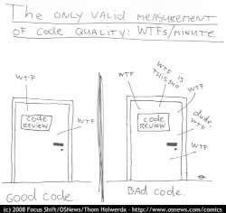

# Preventing human mistakes in software development

(if you are looking for less philosophy and didn't find this page helpful,
please try [another page](../practices) instead)

I am convinced that the best way to prevent mistakes during software development
is to **never write code alone**. It's crucial always to have someone look at
the changes and decisions you are making and try to hear them out if they are
kind enough to provide you with their feedback, no matter how hard that is. Only
humans are capable of writing good code and building sound designs - otherwise,
we all would be out of our jobs by now, replaced by robots in all the greedy
corporations that want to save every dime.

## Bring friends to write code with you - as many as possible!

Human friends are not very easy to get, so we'll start with a couple of more
accessible options - let's bring imaginary friends and robot friends on board
first. They can help catch the most obvious issues, allowing humans to focus on
the items that do require human intelligence and time.

### Imaginary friends (Threat modelling and test scenarios)

As you may guess, imaginary friends don't require much effort to get...
This somewhat describes what security teams keep asking software
engineers to do - imagine a hacker trying to do something malicious to the
system and come up with some scenarios that the team did not anticipate when
working on the system's original design. We need someone to be constantly asking
all those unexpected questions such
as "[What if my name is Robert'); DROP TABLE students;-- ?](https://www.explainxkcd.com/wiki/index.php/Little_Bobby_Tables)"
or "[What if I request a negative amount of items to be placed into my shopping cart?](https://owasp.org/www-community/attacks/Web_Parameter_Tampering)"
.

One can have as many imaginary friends as they want (until they start mentioning
that to someone else). Want to know who's my best imaginary friend?
[Batman](https://arstechnica.com/information-technology/2017/07/how-i-learned-to-stop-worrying-mostly-and-love-my-threat-model/),
of course.

Jokes aside, this is a conversation mainly
about [Threat Modelling](https://en.wikipedia.org/wiki/Threat_model). And it's
wrong to assume that there are no existing resources that help with all these
scenarios created by teams of brilliant people working together for years. Some
of which have even become industry standards and frameworks. But at the same
time, this section of the page is the hardest for me to make any specific
recommendations - like everything that involves human thought processes and
brainstorming, the list of resources is enormous. So I'll just limit this to
what I think is the best starting point:
[**The Open Web Application Security
Project's (OWASP) Threat Modeling
page**](https://owasp.org/www-community/Threat_Modeling).

And since this conversation is also about bringing as many friends on board as
possible, let me introduce you
to [OWASP Threat Dragon](https://owasp.org/www-project-threat-dragon/), an
excellent tool to help you with your threat modeling process and a perfect
segway to the next section.

### Robot friends (Tools and automation)

Everybody wanted to have a robot friend when we were kids (until we learned they
want tp replace us at our job, right). And in software development, we can make
that dream come true.

If somebody asked me for the sole advice I'd give to software engineers, that
advice would always be to **use [SonarLint](https://www.sonarlint.org/)**. It
takes seconds to install it with the most popular IDEs, entirely changing the
code writing experience. Indeed, an excellent robot friend to have.

There are many potential robot friends available out there to help with all
sorts of tasks, from architecture and design to decision making, collaboration,
automation, and all the way down to writing the code.

If you are looking for my recommendation on robots to include in your project,
the list is below.
But if you are about to start the search on
the Internet, I recommend looking for your project's programming language,
platform, or even tool, prefixing them with the
word "[awesome](https://awesomelists.top/)." For example,
"Awesome Kotlin" or "Awesome Node." That's an excellent way to start or improve
any project, even though I fully understand this is slightly off-topic from our
conversation about robots.

Here's the list of my closest robot friends, who I always bring with me to any
project:

*   [Intellij IDEA Ultimate](https://www.jetbrains.com/help/idea/code-inspection.html)
    is practically pair-programming with me at all times. I cannot imagine
    writing code without it.
*   [SonarLint](https://www.sonarlint.org/) usually paired
    with [SonarQube](https://www.sonarqube.org/) to improve my code quality (and
    make it easier for other humans to work with)
*   [Semgrep](https://semgrep.dev/) - the newest addition to this list. It
    replaced Veracode for me, believe it or not. Too good to pass it by as a
    [static analysis](https://en.wikipedia.org/wiki/Static_application_security_testing)
    tool.
*   [Snyk](https://snyk.io) - my top choice for code and dependency security
    checking.
*   [Zaproxy](https://www.zaproxy.org) and [sqlmap](https://sqlmap.org/) - my
    defaults before the company provides another means for
    [security checks against a running instance](https://en.wikipedia.org/wiki/Dynamic_application_security_testing)

And since I am using GitHub for [my projects](https://github.com/samoylenko):

*   [GitHub Actions](https://github.com/features/actions) - continuous delivery.
*   [CodeQL](https://codeql.github.com/) - GitHub's own static code analysis tool.
*   [Dependabot](https://github.com/dependabot/) - automated dependency updates.

And I probably should mention the robot friend helping me draft this text -
[Grammarly](https://www.grammarly.com/).

#### Automation and tests - "hybrid robot-imaginary friends"

It's a vast topic, so I can only briefly touch on it here. Everything I am doing
as an application security engineer aims to prevent human mistakes. An essential
part of that is to eliminate manual steps wherever possible, so I can't stress
the importance of automation of every step in the software delivery and
deployment pipeline enough.

I thought it's worth bringing up test automation as one of the most critical
aspects of eliminating human mistakes in software development. Even if the team
does not yet have a mature continuous delivery pipeline, it's never too early
to start creating automatic tests. Actually, I recommend it even _before_
starting work on the project's code.

##### Test-driven development (TDD)

Continuing our "bring friends to write code with you"
metaphor, [test-driven development (TDD)](https://en.wikipedia.org/wiki/Test-driven_development)
results in adding somewhat a hybrid robot friend that we create by ourselves
using the scenarios we come up with. In my experience, using this approach
significantly improves software quality and design, and I can't recommend it
highly enough.

### Human friends (Collaboration and communication)

But no tools can replace teaming up with a fellow human - one can't rely on
robots and imaginary friends if they want to step out of the sandbox. And
historically, this has been one of the biggest challenges on any project. Each
person is unique, and each sees every unit of work from a different angle. I
won't dare write about communication and soft skills here, but I think I won't
be entirely wrong if I say that being different is our strength and not the
other way around, especially in complex technical projects.

#### Help other people help you

I am not the best person to make recommendations on how to meet new people, but
I hope that you are currently not the only person working in the company. So
I'll assume there are other people around already — hopefully, a team (broad
definition, I know, but it'll do).

##### Open the code to as many people as possible

Working on the update of this page in 2022, I do not know of any valid scenario
to make a software project completely private - I think the application security
industry has proven by now, in every way possible, that there is no
"[security by obscurity](https://en.wikipedia.org/wiki/Security_through_obscurity)
."

And letting other people read and contribute to the code is the first, necessary
step towards getting their help. This doesn't have to be the 'all-write'
permission on the repository - 'all-read' is usually enough, assuming that the
source code management system
allows [forking](https://docs.github.com/en/get-started/quickstart/fork-a-repo)
the repository and
[pull](https://docs.github.com/en/pull-requests/collaborating-with-pull-requests/)
(or [merge](https://www.tutorialspoint.com/gitlab/gitlab_merge_requests.htm)-)
requests.

##### Value human time

The most valuable asset we have is our time, and I firmly believe that the best
way to get other people's help with the project is to ensure that they won't be
wasting their time. That it will be easy for them to contribute, test, review or
even just share their thoughts about the project.

###### Documentation - create at least basic project documentation (quickstart)

When they see a potential way to help, most people usually try to do that. But
even with access to the code, they need to know how to build and test their
solution. So even a basic "quickstart" instruction can make a difference whether
they contribute to the project or carry on to doing something else.

###### Automation - eliminate potential conflict points by using a robot friend as a fair arbitrary

The other common issue preventing people from contributing to software projects
is the differences in how they write the code. Everything, from preferring tabs
over spaces and curly braces on the new line to "But I didn't break the build.
It works on my computer!"

There is no pleasure in being asked to replace tabs with spaces in a pull
request that fixes a major issue and having a fight over code style in comments.
Especially if these rules are not known until after the request has been
submitted.

And that's where it pays to have our robot friends we discussed
earlier - they can serve as a fair arbitrary for everything, from ensuring that
the code can be successfully built and all tests passed down to enforcing the
code style, quality, and test coverage.

###### Automation - make sure robots perform all the work they can before starting to spend human time

It's essential to ensure that valuable human time is spent wisely, and that
before a fellow human takes a look at code, robots have already detected and
helped fix all basic issues and "low-hanging fruits."

Since I officially work in the Application Security industry and claim
automation expertise, I've spent countless hours embedding all tools I could put
my hands on in the build pipeline. As a result, I am convinced that the rule is
**the more robots you get working before your code is seen by a human, the
better**.

There's a good example that works well every time. Try running
[Zaproxy](https://www.zaproxy.org/) against your HTTP endpoint. Those are some
low-hanging fruits that you don't need an expensive white hat hacker to spend
their time discovering.

###### Make it as easy as possible for humans to participate

After we have done everything possible to ensure that we spend valuable human
time only where we need it, it's also essential to help other people help the
project. They are busy doing their own work, and the easier we make it to help
them help us, the more issues we catch working altogether.

The vast majority of the teams I've been working with use the pull request
process to request human review. So the best recommendation I can make here is
to follow pull request best practices. Here are some that I am particularly fond
of:

*   "[The (written) unwritten guide to pull requests](https://www.atlassian.com/blog/git/written-unwritten-guide-pull-requests)"
    by Atlassian
*   "[The Change Author's Guide](https://google.github.io/eng-practices/review/developer/)"
    by Google

There is, however, an excellent point made
by [Dave Farley](https://twitter.com/davefarley77), who offers an alternative
approach in his
video "[Why Pull Requests Are A BAD IDEA](https://www.youtube.com/watch?v=ASOSEiJCyEM)
." And my personal experience shows that he is right. I believe that this
entire page somewhat complements his point of view as well.

## Next steps from here

*   [Learning Application Security](../learn)
*   [Secure Coding Practices](../practices)
